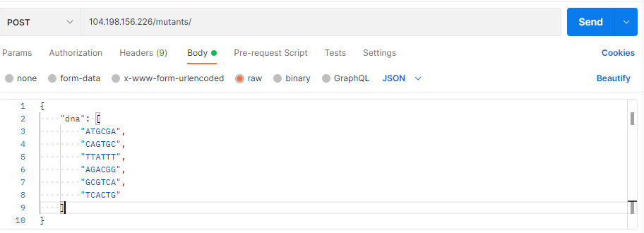

# Reto de mutantes

## Requerimientos
Para la implementación es necesario tener instalado Node.js, Docker y un servidor 
Apache.

##Instalación
Para iniciar la instalación de este servicio es necesario ejecutar en la raíz del
proyecto `npm install`.

##Ejecución

Para la inicialización del servicio se debe ejecutar `npm start` desde la raíz
del proyecto. 

>Nota: La API quedará corriendo en el puerto 3000 para cambiarlo se debe modificar
> el archivo `server.js`

## Mejorar el rendimiento del API
Para mejorar el rendimiento del API y pueda soportar peticiones de 100 a 1000000 
se sugiere una solución de balanceador de cargas en conjunto con dos contenedores.

Es necesario construir dos contenedores con diferentes puertos asignados a los 
servicios creados en cada uno por lo tanto se deberá modificar `server.js` antes 
de construir cualquier contenedor en conjunto con `Dockerfile` dónde se debe cambiar
`EXPOSE XXXX` por el puerto deseado.

Para generar los contenedores se debe ejecutar `docker build -t NOMBRE_DOCKER .`
<br>
Una vez los docker han sido creados se deben levantar dos o más instancias con 
`docker run -p PORT:PORT -d DOCKER_IMAGE_NAME` utilizando diferentes puertos para 
cada uno de estas.
<br>

Por último se debe agregar la configuración de balancer al sitio web que para 
propósito de este proyecto fue creado en Apache
<br>
```
<Proxy balancer://melibalancer>
    BalancerMember http://127.0.0.1:3000 route=1
    BalancerMember http://127.0.0.1:3001 route=2
    ProxySet lbmethod=bytraffic
</Proxy>

ProxyRequests Off
ProxyPreserveHost On
ProxyPass "/" "balancer://melibalancer/"
ProxyPassReverse "/" "balancer://melibalancer/"
```

#API

El proyecto está corriendo sobre el endpoint **http://104.198.156.226/mutants/** y
devolverá código 403 en caso de que no sea mutante y un 200 en caso de que sí.
##Ejemplo de petición


>Nota: Las peticiones se pueden encontrar en el siguiente 
> [Postman](https://documenter.getpostman.com/view/16798673/TzshHQZz).